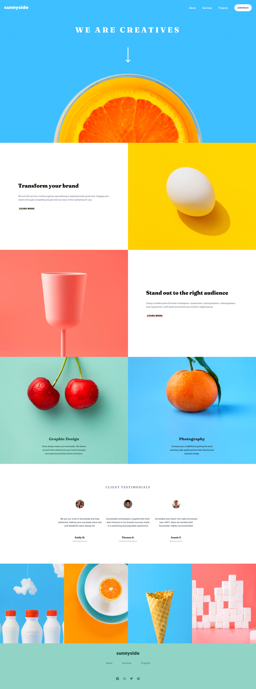

# Frontend Mentor - Sunnyside agency landing page solution

This is a solution to the [Sunnyside agency landing page challenge on Frontend Mentor](https://www.frontendmentor.io/challenges/sunnyside-agency-landing-page-7yVs3B6ef). 

## Table of contents

- [Overview](#overview)
  - [The challenge](#the-challenge)
  - [Screenshot](#screenshot)
  - [Links](#links)
- [My process](#my-process)
  - [Built with](#built-with)
  - [What I learned](#what-i-learned)
- [Author](#author)

## Overview

### The challenge

Users should be able to:

- View the optimal layout for the site depending on their device's screen size
- See hover states for all interactive elements on the page

### Screenshot

### Links

- Solution URL: [sunnyside-agency-landing-page-FEMC](https://github.com/MikeyOnyedika/sunnyside-agency-landing-page-FEMC)
- Live Site URL: [sunnyside-agency-landing-page-femc.vercel.app/](https://sunnyside-agency-landing-page-femc.vercel.app/)

## My process

### Built with

- Semantic HTML5 markup
- CSS custom properties
- Flexbox
- CSS Grid
- Mobile-first workflow
- Javascript proxy

### What I learned
- I got to experiment with Javascript proxies which allows you to listen for when the value of a variable has changed. 
- I had more practice with responsive design
- I learned about nesting in native css; without any libraries!

## Author

- Frontend Mentor - [@MikeyOnyedika](https://www.frontendmentor.io/profile/MikeyOnyedika)
- X (Twitter) - [@Mikey](https://x.com/Mikey24820494)